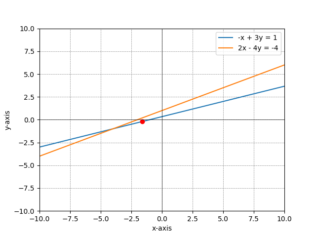

# Solving Linear Systems of equations
### Row/ Column/Matrix forms

Let say we'd like to write the system equations below in row form, column form, and augmented matrix form:

\( 35x + 21y = 11z + 100 \)

\( 25z = 10x + 24y + 100 \)

To rewrite the above system in different forms, we would proceed as follows:

**Row form:**

The equations written out, one per line:

$$
\begin{aligned}
35x + 21y - 11z &= 100 \\
10x + 24y - 25z &= -100 
\end{aligned}
$$

**Column form:**

$$
\begin{align*}
x(35) + y(21) - z(11) &= 100 \\
x(10) + y(24) - z(25) &= -100
\end{align*}
$$

**Augmented matrix form:**

$$
\left[\begin{array}{ccc|c}
35 & 21 & -11 & 100 \\
10 & 24 & -25 & -100
\end{array}\right]
$$

Replace \( x \), \( y \), and \( z \) with their respective coefficients in each form as shown.

### Solving a system of Equations with Python

Let say we want to find the solution to this system, the point where the two lines represented by these equations intersect:
- \( -x + 3y = 1 \)
- \( 2x - 4y = -4 \)

**To solve it**

We use Matplotlib library to plot the lines and the NumPy library 
First, let's define the equations as functions:

```bash
import numpy as np

def line1(x):
    return (1 + x) / 3

def line2(x):
    return (2*x + 4) / 4
```
Then we'll ploy the lines using Matplotlib:
```bash
import matplotlib.pyplot as plt

# Create an array of x values from -10 to 10
x_values = np.linspace(-10, 10, 400)

# Plot the two lines
plt.plot(x_values, line1(x_values), label='Line 1: -x + 3y = 1')
plt.plot(x_values, line2(x_values), label='Line 2: 2x - 4y = -4')

# Add labels and legend
plt.xlabel('x')
plt.ylabel('y')
plt.legend()
plt.grid(True)
plt.axhline(0, color='black',linewidth=0.5)
plt.axvline(0, color='black',linewidth=0.5)
``` 
Finally, we solve the system using Numpy's `linag.solve` function:
```bash
# Coefficients matrix (A) and constants vector (b)
A = np.array([[1, -3], [2, 4]])
b = np.array([-1, -4])

# Solve for x and y
solution = np.linalg.solve(A, b)

# Plot the solution on the graph
plt.plot(solution[0], solution[1], 'ro')  # red dot for the intersection
plt.show()
``` 
**Visualizing the Row and Column Pictures**
*(you can found complete codes [here](<../codes/2. visualizing equation solutions.py>))*



### Notes about Numerical Error
**Floating-Point Arithmetic**

When working with floating-point numbers in Python, results may not always be what you expect due to the way computers represent these numbers. A classic example is the addition of 0.1 and 0.2:

```bash
print(0.1 + 0.2 == 0.3)  # This will print False
```
This is because floating-point numbers are represented in a binary format that cannot precisely represent certain decimal fractions. As a result, the sum of 0.1 and 0.2 does not exactly equal 0.3 in binary floating-point arithmetic, leading to a false comparison.

Here's example of how to write it using Numpy:
 ```bash
 import numpy as np

# Defining an integer array and a list
J = np.array([20])
L = [20]

# Comparing their 8th powers
print(pow(L[0], 8) == pow(J[0], 8))  # This should return True
```
#
**Next**: *Linear Algebra and Python*

